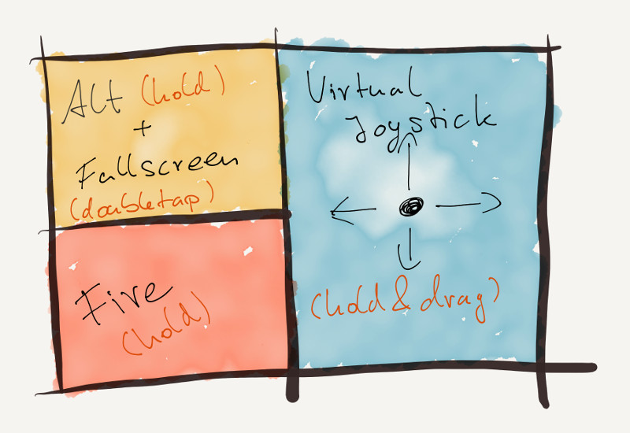
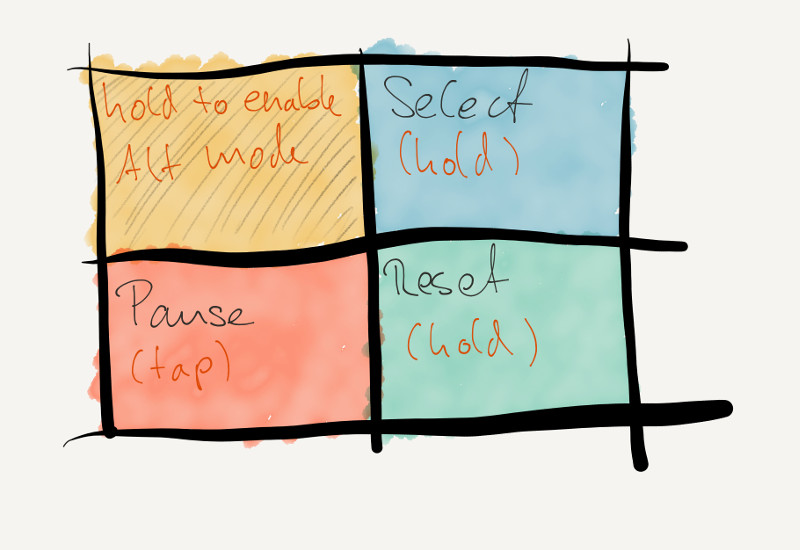
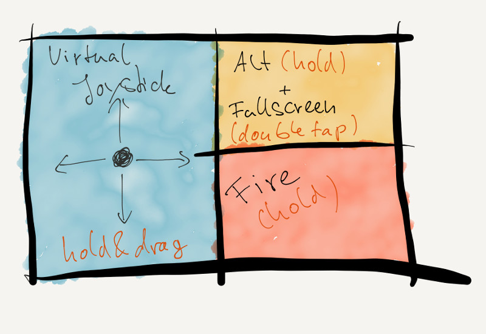
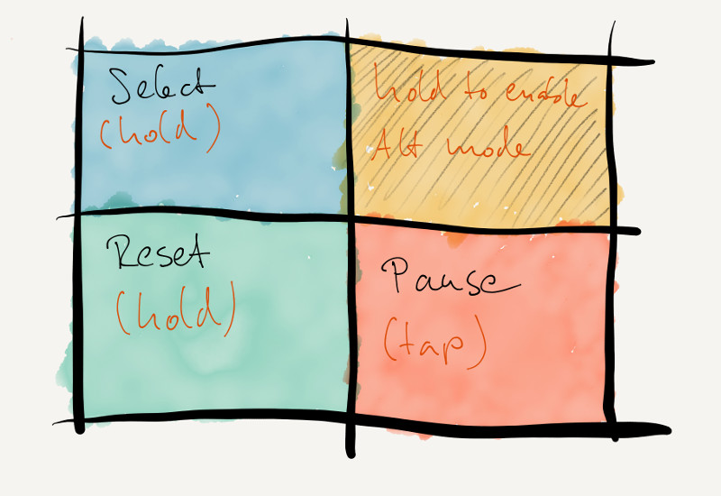

Stellerator is an emulator for the Atari 2600 VCS (Stella) developed as part
of the 6502.ts project. Stellerator runs the vast majority of
games for the VCS flawlessly, including both original games, demos and homebrews. Most
cartridge types and bankswitching schemes are supported, including ARM-based DPC+
cartridges.

Among other things, it supports hardware accelerated graphics with POV /
phosphor simulation and jitter-free audio emulation. Cartridges are stored
locally in the browser, no data is transferred over the web.

The source is available under the MIT license on
[github](https://github.com/6502ts/6502.ts). Feel free to fork, explore and contribute.

# Loading and running ROMs

The "Cartridges" page allows you to import, configure and run ROM image files.
Image files can be loaded directly from ZIP files.

## Available Settings

 * **Name:** The cartridge name as displayed in the cartridge list. Defaults to the
   name of the image file.
 * **TV mode:** Use this setting to change the emulated TV type.
   The default is guessed from the filename.
 * **Cartridge type:** Size and bankswitching type of the catridge. This is autodetected
   and should not be changed under normal circumstances.
 * **Emulate paddles:** Normally, Stellerator emulates four paddles. Some games
   (notably Thrust) have their controls messed up by the presence of the paddles
   unless they are turned off by this option.
 * **RNG seed:** Upon startup, the emulated hardware is initialized to a random
   state. Fixing the seed will remove the randomness and will fix
   the initial state. This allows to reliably run buggy games that otherwise
   fail to start depending on the initial state (e.g. Dark Chambers).
 * **First visible frame line:** Determine the first visible line of the image.
   The default is auto detection ("auto") and should work fine for the vast majority
   of ROMs. For problematic cases, this can be set to a fixed value. Typical values
   of real CRTs lie somewhere around 30 scanlines.
 * **CPU emulation accuracy:** Override the accuracy with which the CPU is emulated. See
   below for the different options.
 * **Audio Driver:** Override the audio driver configured in the settings. See below
  for a detailed description of the available choices.
 * **Volume:** Allows to control audio on a per-cartridge basis.
 * **Enable touch controls:** Enable / disable touch controls
 * **Left handed mode:** Switch touch controls to left handed mode (see below)
 * **Virtual joystick sensitivity:** Control the minimum drag distance for the virtual
   joystick to respond. The lower you set this value, the more sensitive the joystick
   will be to finger movement.

# Global Settings

The "Settings" page allows to configure global emulation settings.

## General Settings

 * **Use worker:** Run the emulation core on a background worker. This is enabled
   by default and allows for smoother framerates, but slow machines might
   actually profit from disabling this option. Changing this setting will require
   a page reload to apply.

* **CPU emulation accuracy:** Change the default accuracy with which the CPU is emulated. See
   below for the different options.

## Audio Settings

 * **Volume:** Overall volume.

 * **Audio Driver:** Switch the default audio driver. See below for a detailed description of
   the various options.

## Video Settings

 * **Smooth scaling:** Toggle smooth scaling of the image.
 * **WebGL rendering:** Stellerator uses hardware accelerated rendering to provide
   phosphor simulation and gamma correction. Disable this if you are experiencing
   video issues.
 * **POV / Phosphor emulation:** Toggle the simulation of persistence of vision / CRT phosphor
   effects by averaging over consecutive frames. This affects WebGL rendering only.
 * **Gamma correction:** Adjust gamma correction. This affects WebGL rendering only.
 * **Reduce framerate:** Merge frames in pair. Reduces rendering load and provides another
   way of emulating phosphor / POV. Note that enabling this together with POV / phosphor
   emulation will yield an extreme phosphor effect.

   **Note** Due to a bug in Safari 11.1, this functionality is currently disabled
   on Safari and iOS.
 * **Sync rendering to browser redraw:** This syncs rendering to the browsers redraw
   cycle and will avoid tearing (provided the system supports it). However, this can
   lead to frame drop for displays with low refresh rates.

# Emulation

## Control Panel

On the emulation page, the emulator can be controlled with the control panel
on the right.

 * **Difficulty left/right:** Controls the corresponding switches on the VCS.
 * **TV mode:** Controls the corresponding switch (color / BW) on the VCS.
 * **Limit framerate:** Toggle frame rate limiting. Without limiting, emulation
   will run at the maximum speed the browser can deliver.
 * **Reset:** Hard reset the VCS. Note that RAM contents are preserved, which causes
   some buggy games to restart in funky states.
 * **Pause / Resume:** Stop and resume the emulation.

## Keyboard controls

The keyboard controls are explained on the emulation page. Both joysticks and the
select / reset buttons on the VCS are controlled via keyboard.
In addition, there are keys for resetting the emulator, pause / resume and
toggling fullscreen mode.

## Gamepad controls

Stellerator supports controlling the two joysticks and select / reset with gamepads.
As the emulator currently does not provide a way to change the button mapping,
your mileage may vary. If one or two supported gamepads (for which the browser
reports a well-defined mapping) are plugged in, the top bar will display
"A" or "AB" in the top right corner.

## Touch controls

Stellerator can be controlled by touch gestures on touch capable devices. The touch
controls divide the VCS video image into the four quadrants NW (top left), NE (top right),
SW (bottom left) and SE (bottom right).

In "normal mode", the controls are:

 * NW: Double tap to toggle fullscreen, hold to switch to "alt" mode (see below)
 * SW: Fire
 * NE / SE: Hold and drag to control a virtual joystick that is centered at your
   intial touch position.

While you are touching NW, the controls enter "alt" mode:

 * SW: Tap to pause / unpause
 * NE: Select
 * SE: Reset

The touch controls can be changed to "left handed" moded in the settings. This
basically mirrors quadrant assignment horizontally:

## Paddle emulation

While Stellerator emulates all four paddles, currently only one paddle one can
be controlled. The paddle is mapped to the horizontal mouse position;
fire corresponds to joystick 0 / right.

## Fullscreen mode

Pressing enter toggles fullscreen mode.

# Audio emulation

Stellerator supports two different ways to emulate audio in a browser environment,
which both have their issues and merits. The default is PCM.

## TL;DR

The default ("PCM") should work fine. Consider switching to "Waveform" if you
have performance issues, crackling artifacts or find the small audio lag
unbearable.

## PCM

This will produce a continuous stream of PCM audio data that is played back in
realtime. The stream is cycle exact and fully supports both "normal" TIA audio
and advanced effects like digitized samples (as used in Quadrun) or synthesized
music (e.g. Pitfall II, Stay Frosty 2).

The downside is that a browser is a very bad environment for anything realtime,
and even small lags will lead to popping noises. Stellerator attempts to
mitigate this by buffering audio data, but the price is a small lag of ~3 frames
between audio and video. Still, PCM provides highly accurate emulation and should
work fine for most people, although the mileage might vary on slower systems and
with certain OS / browser combinations.

## Waveform

In this mode, the emulator determines the current pattern (AUDC und AUDF) played
by the TIA and instructs the browser to loop it until changed. Volume changes
(AUDV) are handled natively by the browser.

This approach is much more tolerant to timing glitches than PCM. Lag will
prolong the individual notes played by the TIA, but no popping occurs, and small
speed variations are virtually unnoticable. There is no noticable lag between
audio and video.

The price for this is emulation accuracy. Most games will sound just fine, but
keen ears might spot small differences, and PCM playback via bitbanging will not
work (e.g. affecting Pitfall II, Quadrun, Stay Frosty 2 and others).

# CPU emulation

There are two different accuracy levels for CPU emulation.

## TL;DR

Use "Cycle" unless you encounter performance problems.

## Cycle

This mode provides a cycle exact model of every bus access. However, it is about 20%
slower than the faster "Instruction" mode.

## Instruction

This mode provides cycle exact CPU emulation as well, but multiple bus accesses may
be batched in a single cycle. This is faster than "Cycle" mode, but compatibility
is slightly worse.

In practice, the only game known to habe issues with "Instruction" mode is Pole
Position.

# Browser support and emulation speed

Stellerator aggressively uses many modern web technologies, some of which are
part of the ES6 standard. Therefore, a recent browser is required to run the
emulator.

Stellerator is tested and works fine on current versions of Chrome, Firefox
and Safari. Microsoft Edge works, but performace is abysmal. Performance is best
in Chrome and Safari, Firefox may lag on DPC+ cartridges.

The emulator runs at full speed (approximately 3.5 MHz / 60 FPS in NTSC mode)
on any modern x86-based machine. On ARM based mobile devices, speed varies greatly.
Android devices usually are incapable of running the emulator at full speed. Modern
64bit iOS devices run the emulator well.
During emulation, the current
clock of the emulated system is displayed in the upper right corner.
Chrome / V8  and JavascriptCore / Safari tend to be faster than Firefox.

If you run into performance issues, switch CPU accuracy  to "instruction"
and set the audio driver to waveform. Turning on frame merging and disabling the web
worker can can help as well.

# Current limitations

 * Keyboard and gamepad mappings cannot be configured.
 * Only the first paddle can be controlled.
 * Audio on Safari on both iOS and MacOS may require a touch or click to start. This is a restriction
   imposed by Apple, and nothing can be done about it.
